# Babel + AI

Cybersecurity is a literal Babel — every platform speaks a different dialect, and detection rules written for one rarely run on another. Babel reverses the challenge: Built on the updated [SIGMA](https://sigmahq.io/) open standard and running natively inside modernized Elastic and Kibana, it lets security teams author, convert, test, deploy, and track detection rules across platforms and tools from a single interface aligned to the incident response lifecycle and tactics, techniques, and procedures.

> **Babel is a Kibana plugin — not a Fleet integration.**
> It cannot be installed from the Kibana Integrations page. Install it via Docker Compose: `docker-compose up --build -d` — the full stack starts automatically. See [Quick start](#quick-start-docker-compose).

## Solution Views

### Rule Editor
Write SIGMA rules in the YAML editor (left), see auto-populated fields in the Visual Editor (center), and get instant format conversion in the Elasticsearch Output panel (right). One-click **Open in Discover**, **Backtest**, and **Deploy** actions sit above the output.

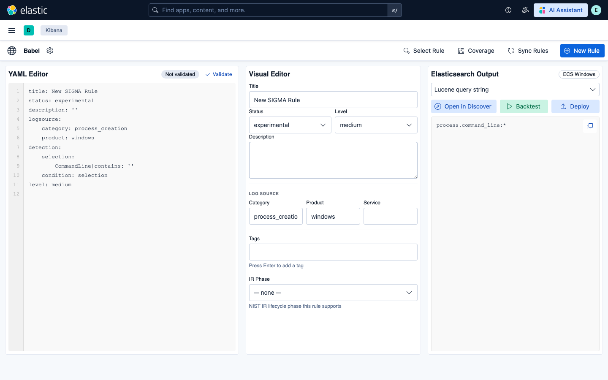

### Real Rule — Full Metadata and EQL Conversion
Load any rule from the library to see its full SIGMA YAML, auto-populated Visual Editor fields (title, status, level, description, logsource, MITRE tags, IR phase), and live converted output. Here an AWS CloudTrail rule converts to EQL in one click.

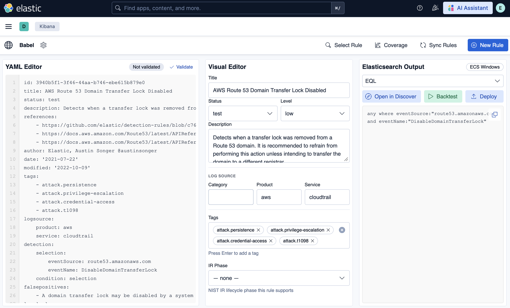

### AI Assistant — draft from an IOC
Draft, explain, and improve SIGMA rules with the model of your choice — a local Ollama model by default, so nothing leaves your host. The **IOC → Rule** tab turns an indicator (here an IP) into a complete rule — logsource, detection, level, MITRE tags, false positives — ready to **Load into Editor**. Sibling tabs cover **Alert → Rule**, **Explain**, and **Improve**.

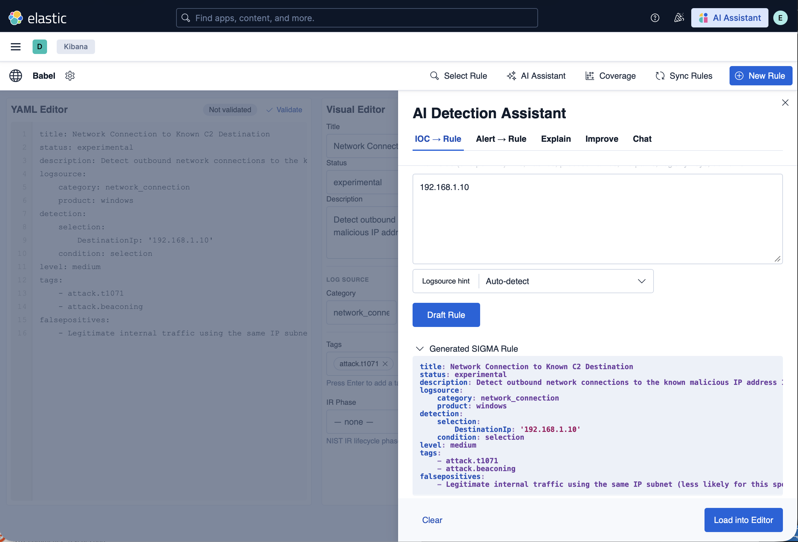

### AI Assistant — chat from a CVE or threat report
The **Chat** tab is a conversational detection-engineering assistant. Paste a CVE write-up or threat-intel URL — or just describe a behavior — and it reads the advisory and drafts a matching rule; here one link yields a detection for a Cisco SD-WAN authentication bypass (CVE-2026-20182). The rule open in your editor rides along as context on every message.

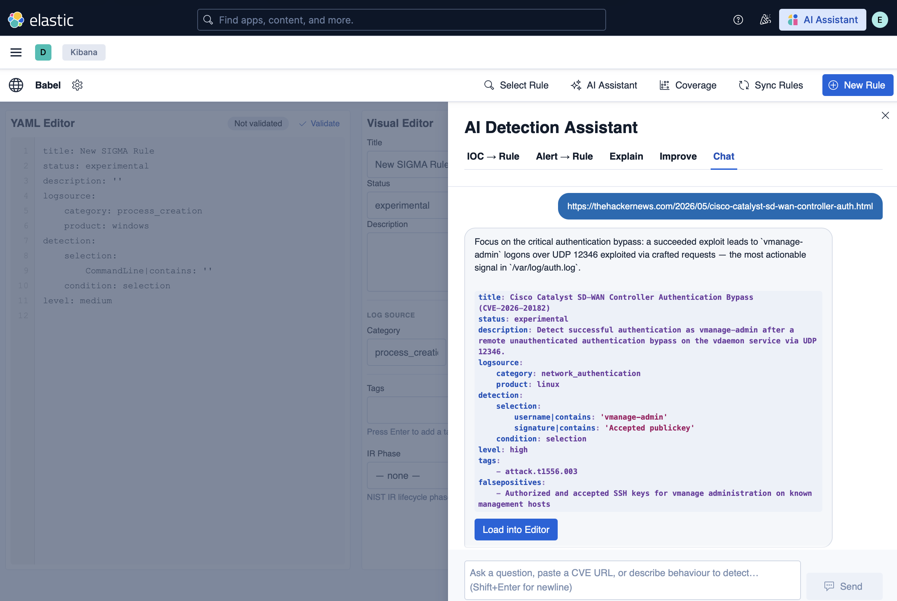

### Multi-Format Conversion
Switch the output format from the dropdown — Lucene, EQL, ES|QL, Query DSL, Kibana NDJSON, SIEM Rule, or ElastAlert — and the converted query updates instantly.


### MITRE ATT&CK Coverage Heatmap
The Coverage view maps your rule library across all 14 ATT&CK tactics. Each cell shows technique coverage with a six-level color scale: no coverage → 1 rule → 2–5 → 6–10 → 11–20 → 20+ rules. Summary stats show total rules, techniques hit, and tactics covered.

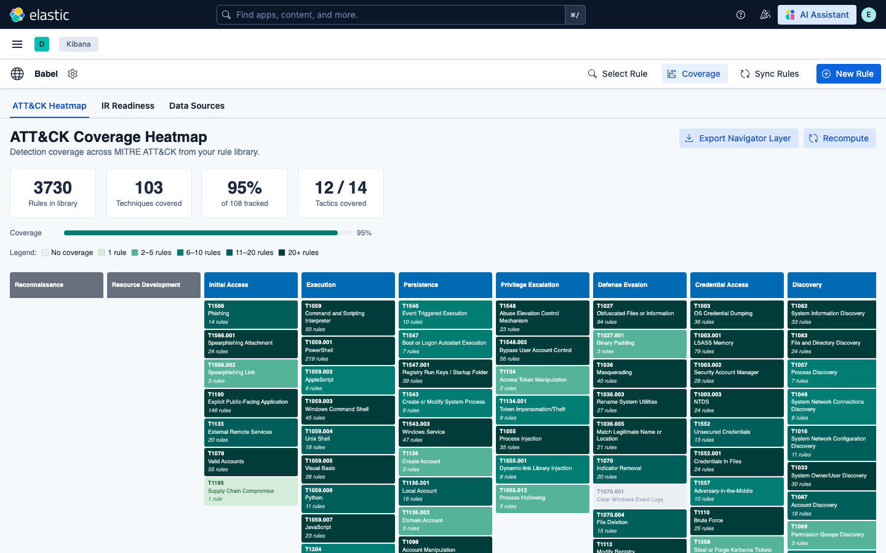

### IR Readiness Report
The IR Readiness tab assesses detection coverage against five threat scenarios — ransomware, APT, insider threat, data breach, and supply chain. Select a scenario and click Analyze for a phase-by-phase breakdown.

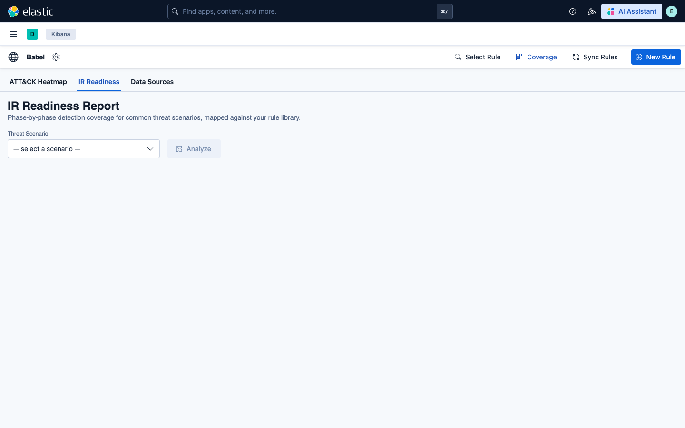

Running the Insider Threat scenario shows 94% technique coverage across 5/5 phases, with covered and missing techniques listed per phase alongside the specific rules providing coverage.

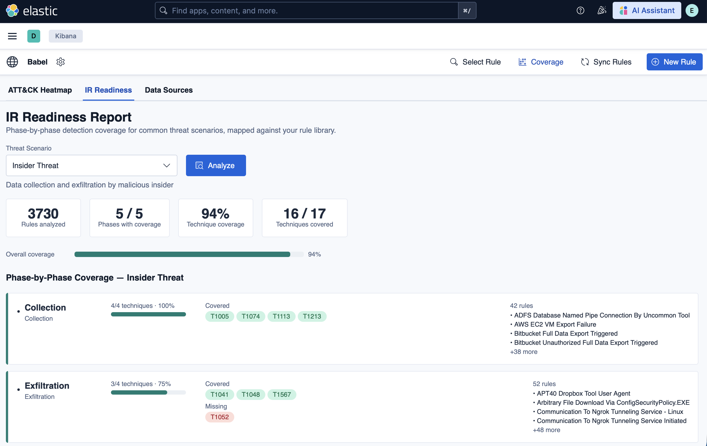

### Data Source Awareness
The Data Sources tab maps your Elasticsearch indices against SIGMA logsource categories. Sources with no matching index data are flagged — rules targeting those sources won't produce alerts until the data is ingested.

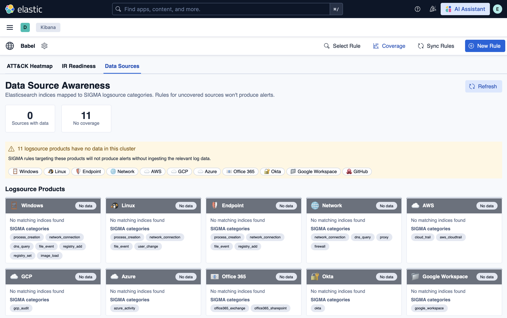

### Rule Library
The Select Rule overlay searches all 3,730 synced rules by title, description, or technique ID. Filter by tactic or IR phase; click any row to load the rule directly into the editor.

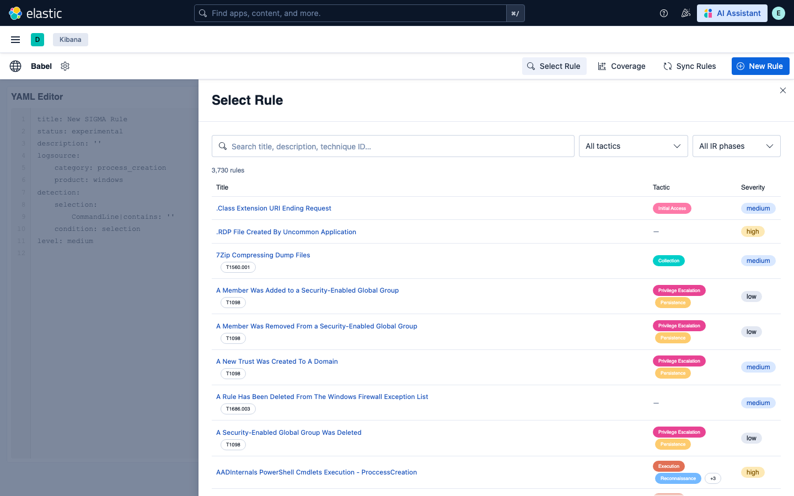

### GitHub Repository Settings
Configure multiple GitHub repositories as rule sources — including separate paths within the same repo. Rules are synced per-repository with full isolation.

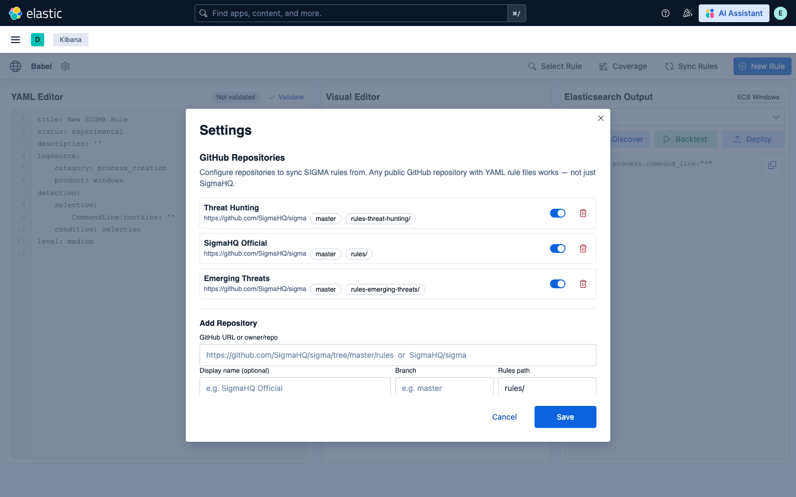

### Integration Status
The Settings panel shows live connectivity to the Babel API and Elasticsearch, available data source categories, and all configured repositories with their enabled state.

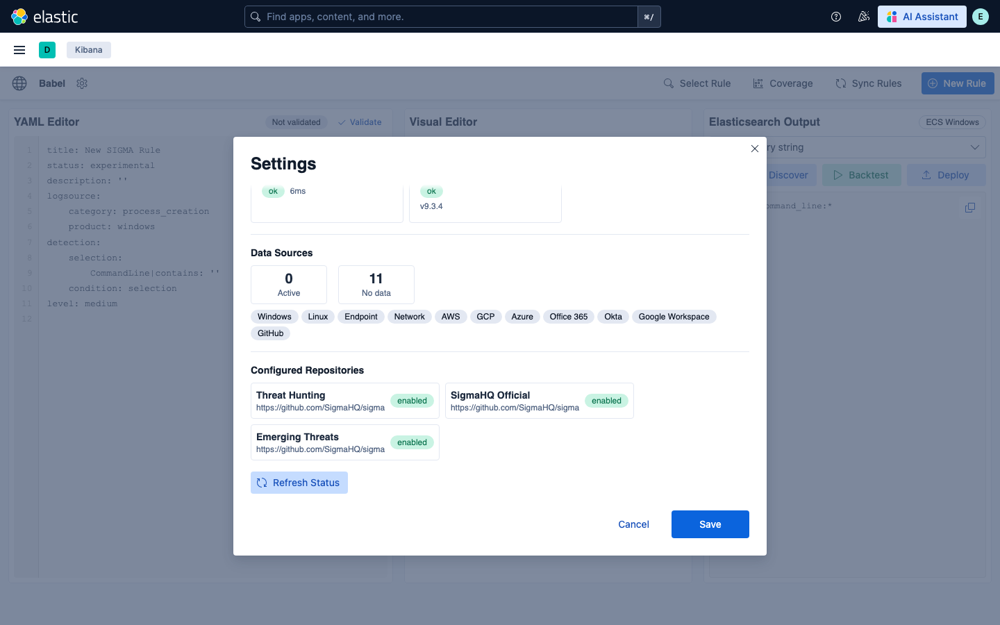

### AI Connectivity — choose your model/provider
The **AI connectivity** area of Settings offers three ways to wire AI — pick whatever fits your deployment. The **LLM Provider** panel selects the model that powers Babel's AI panel: a local model via Ollama (default), a hosted provider (Anthropic, OpenAI), an OpenAI-compatible endpoint, or a Kibana connector. Set the **Base URL** and **Model name** for your choice; keys are stored in Elasticsearch and never exposed to the browser.

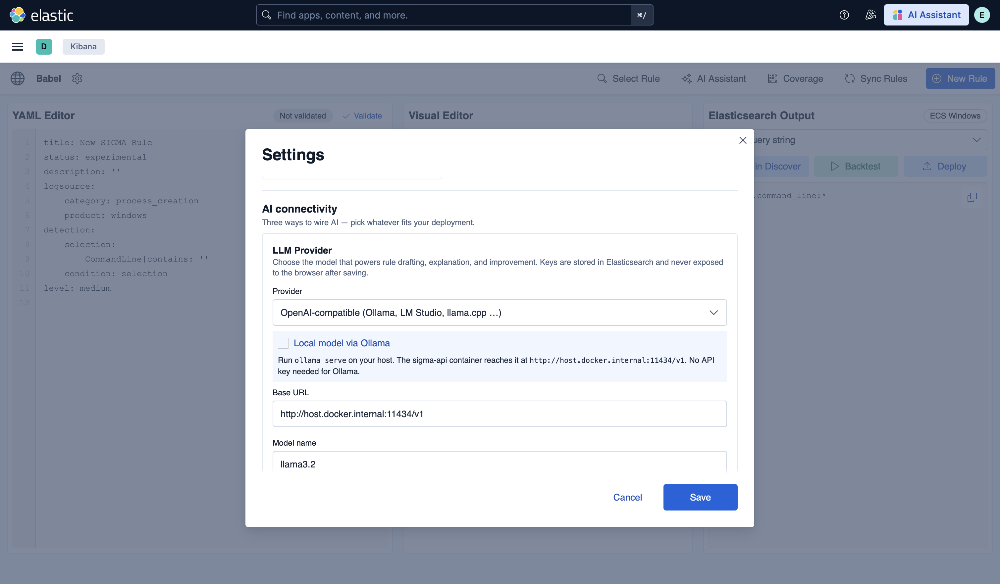

### AI Connectivity — external agents (MCP)
The **External agents (MCP)** panel surfaces a ready-to-copy `.mcp.json` snippet for pointing Claude Desktop or Claude Code at Babel's MCP server — exposing the SIGMA tools (convert, validate, draft, explain, …) to an external agent, with no in-cluster or local model required. The panel reminds you the config holds a Kibana credential and links to the security notes.

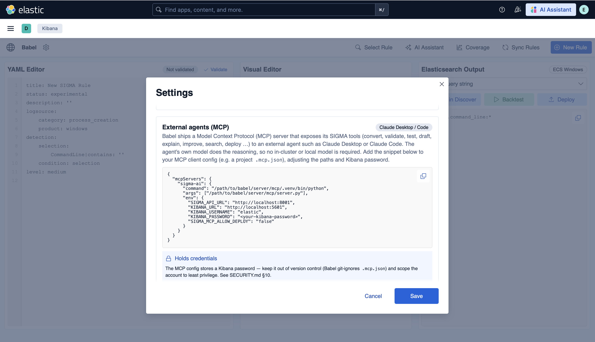

---

## Features

- **YAML editor** — write and validate SIGMA rules with real-time syntax feedback
- **Visual rule builder** — construct rules without writing raw YAML
- **AI Assistant** — LLM-powered help for detection engineering, using the model of your choice — a local model via Ollama by default (no data leaves your host), or Anthropic Claude, OpenAI / OpenAI-compatible endpoints, or an Elastic GenAI connector:
  - Draft a SIGMA rule from a list of IOCs
  - Draft a SIGMA rule from a Kibana or Security Onion alert
  - Explain a rule in plain English — detection logic, log sources, MITRE ATT&CK mapping, false positives, and tuning suggestions
  - Improve a rule against your live ECS field mappings, with a summary of what changed and why
  - Chat assistant for interactive rule authoring and detection-engineering questions
  - Provider-agnostic and configurable in Settings; see [AI Assistant — model & key setup](#ai-assistant--model--key-setup)
- **Multi-SIEM conversion** — translate rules to 8 output formats:
  - Lucene query string
  - Query DSL
  - Kibana NDJSON
  - SIEM Rule (JSON / NDJSON)
  - EQL
  - ES|QL
  - ElastAlert
- **Live rule testing** — backtest against Elasticsearch indices with hit clustering
- **Rule deployment** — push rules directly to the Kibana Detection Engine
- **MITRE ATT&CK coverage heatmap** — visualize technique coverage across your rule set
- **IR readiness assessment** — map rules to incident response phases
- **Field suggestions** — auto-map SIGMA fields to ECS fields
- **Schema drift detection** — track changes to Elasticsearch mappings over time
- **Rule quality scoring** — assess rule effectiveness and staleness
- **Data source availability mapping** — inspect available indices, document counts, and field mappings
- **GitHub sync** — pull rules from multiple configurable GitHub repositories (SigmaHQ and custom repos); all rules synced with no cap

---

## Requirements

### Runtime

| Dependency | Version | Notes |
|---|---|---|
| Kibana / Elasticsearch | 9.3.4 | Pinned — see note below |
| Python | 3.11+ | Required by the Babel API |

### Build tools

| Dependency | Version | Notes |
|---|---|---|
| Node.js | 20+ | Build only |
| `zip` CLI | any | Build only |

### npm packages (runtime)

| Package | Version |
|---|---|
| `@elastic/eui` | ^114.3.0 |
| `js-yaml` | ^4.2.0 |
| `react` | ^18.3.1 |
| `react-dom` | ^18.3.1 |

### npm packages (dev / build)

| Package | Version |
|---|---|
| `typescript` | ^5.9.3 |
| `webpack` | ^5.107.2 |
| `webpack-cli` | ^6.0.1 |
| `ts-loader` | ^9.6.0 |
| `html-webpack-plugin` | ^5.6.7 |
| `jest` | ^30.4.2 |
| `jest-environment-jsdom` | ^30.4.1 |
| `ts-jest` | ^29.4.11 |
| `@testing-library/react` | ^16.3.2 |
| `@types/node` | ^20.19.42 |
| `@types/react` | ^18.3.31 |
| `@types/react-dom` | ^18.3.7 |
| `@types/jest` | ^30.0.0 |
| `@types/js-yaml` | ^4.0.9 |

### Python packages (Sigma conversion engine)

These are required by `server/translation_script/sigma/`. Set up a virtual environment before building or running the conversion script:

| Package | Version |
|---|---|
| `pySigma` | >=0.11.0, <1.0.0 |
| `pySigma-backend-elasticsearch` | >=1.0.0, <2.0.0 |

> **Important:** `kibanaVersion` in `kibana.json` is pinned to `9.3.4`. Kibana will refuse to load the plugin on a different version. If your target version differs, re-build with `KIBANA_VERSION=<your-version> npm run build` — the build script patches `kibana.json` automatically before packaging.

---

## Quick start (Docker Compose)

> **Prerequisites:** Docker and Docker Compose. Node.js 20+ is only needed if you are modifying the plugin source.

The full stack — Elasticsearch, Kibana (with Babel), and the Babel API — starts with a single command.

### 1. Configure credentials

```bash
cp .env.example .env
```

Edit `.env` and set at minimum:

| Variable | Purpose |
|---|---|
| `ELASTIC_PASSWORD` | Password for the `elastic` superuser |
| `KIBANA_SYSTEM_PASSWORD` | Internal Kibana service account password |
| `KIBANA_ENCRYPTION_KEY` | 32-character key for encrypted saved objects |

> **Note — existing Elasticsearch volume:** If you previously ran the stack with a different `ELASTIC_PASSWORD`, the stored password takes precedence over the environment variable. Reset it with: `docker exec babel-es bin/elasticsearch-reset-password -u elastic -b`

### 2. Build the Kibana plugin (one-time)

> **This step is required before the first `docker-compose up`.** Unlike most Docker Compose setups, the Kibana image cannot build the plugin at container startup — the plugin must be compiled locally first and is then copied into the image.

```bash
npm install
KIBANA_VERSION=9.3.4 npm run build
```

You only need to repeat this if you modify the plugin source. Normal restarts (`docker-compose up -d`) do not require a rebuild.

### 3. Start the stack

```bash
docker-compose up --build -d
```

This starts four services in dependency order:

| Service | Container | Port | Purpose |
|---|---|---|---|
| Elasticsearch | `babel-es` | 9200 | Rule storage and live rule testing |
| kibana-setup | *(exits after init)* | — | Sets the `kibana_system` account password once |
| Sigma API | `babel-api` | 8001 | Rule conversion, validation, coverage, IR readiness, and AI generation (FastAPI, `server/api/`) |
| Kibana + Babel | `babel-kibana` | 5601 | UI |

First boot pulls images and installs Python dependencies (~2–3 min). Subsequent starts are fast.

### 4. Verify the stack is up

```bash
# Sigma API
curl http://localhost:8001/health
# → {"status": "healthy", "service": "sigma-ui-api"}

# Kibana
curl -u elastic:<password> http://localhost:5601/api/babel/status
# → services: [{name: "Sigma Conversion API", status: "ok"}, {name: "Elasticsearch", status: "ok"}]
```

Kibana is available at **http://localhost:5601** — log in as `elastic` with the password from `.env`.

Navigate to **Babel** in the left sidebar. To check service connectivity, click the **gear icon (⚙)** in the Babel nav bar to open Settings — the bottom of the panel shows live status for the Babel API and Elasticsearch.

### 5. (First boot only) Sync rules from GitHub

The rule library (`babel_sigma_doc` index) is empty on first boot. In the Babel UI:

1. Go to **Settings** → add a GitHub repository (e.g. `https://github.com/SigmaHQ/sigma`, branch `master`, path `rules/`)
2. Click **Sync** — this fetches all SIGMA YAML files from the repo
3. Return to the **Rule Library** tab; rules will appear as the sync completes

> A GitHub Personal Access Token is strongly recommended for large repos like SigmaHQ (~3,000 rules). Without one, GitHub's 60 requests/hour unauthenticated limit will throttle the sync. Use a fine-grained PAT with **Contents: Read** permission only.

### Stopping and restarting

```bash
docker-compose down        # stop (data volumes preserved)
docker-compose down -v     # stop and wipe all data (fresh start)
docker-compose up -d       # restart without rebuilding images
docker-compose up --build -d  # rebuild images (after source changes)
```

---

## AI Assistant — model & key setup

Babel's AI features (draft a rule from IOCs or an alert, explain a rule, improve a rule, and the chat assistant) call a Large Language Model through a provider **you** choose. **Out of the box, Babel is configured to use a local model served by Ollama — no API key, and no detection data leaves your host.** You can switch providers at any time.

Babel offers **three ways to connect AI** — pick whatever fits your deployment. All three are managed under **Babel → ⚙ gear icon → Integration & Status → AI connectivity**:

| Method | What it powers | Needs a local model? | Best for |
|---|---|---|---|
| **1. In-app model** | Babel's own AI panel | No — unless you choose Ollama | Most setups: local Ollama, hosted Anthropic/OpenAI, or a Kibana connector |
| **2. Elastic AI Assistant** (Agent Builder) | Babel's SIGMA agents inside Kibana's native Assistant | No | Elastic Cloud / managed Kibana; teams who work in Elastic's UI |
| **3. External agents (MCP)** | Claude Desktop / Code driving Babel's tools | No | Analysts using Claude on their workstation |

> **The three methods are independent.** The in-app AI panel (Method 1) calls your chosen LLM **directly** through the Sigma API — the MCP is *not* involved. The MCP (Method 3) is a separate, optional integration that only matters when you point an external agent like Claude Desktop at Babel; it's never in the loop for the in-app panel.

**Method 1 — In-app model** has four provider options, configured under *AI connectivity → AI Provider*. Pick one below.

> **Prerequisite:** the AI endpoints live in the **Sigma API** (`server/api`) — the `sigma-api` container the Docker stack builds. If you run a different/older API, the AI panel will have nothing to call.

### Option A — Local model via Ollama (default; best for sensitive data)

1. Install [Ollama](https://ollama.com) on the **Docker host** and make sure it's running (`ollama serve` — it listens on `:11434`).
2. Pull a model. Babel's shipped default is:
   ```bash
   ollama pull hf.co/yuxinlu1/gemma-4-12B-coder-fable5-composer2.5-v1-GGUF:Q4_K_M
   ```
   Any Ollama model works (`llama3.2`, `mistral`, `codestral`, …).
3. In **AI Provider**, choose **OpenAI-compatible (Ollama, LM Studio, llama.cpp …)** and set:
   - **Base URL** — `http://host.docker.internal:11434/v1` (Docker stack) or `http://localhost:11434/v1` (Sigma API running directly on the host)
   - **Model name** — the exact name you pulled
   - **API Key** — leave blank
4. **Save.** If you keep the shipped default, steps 1–2 are all you need.

> **Networking:** the Sigma API runs in a container and must reach Ollama on the host via `host.docker.internal`, **not** `localhost`. The compose file already adds the `host.docker.internal` host-gateway mapping (needed on Linux).
>
> **Hardware:** a 12B model at Q4 wants ~8 GB RAM/VRAM and runs ~30–60 s/request on CPU. Use a smaller quant (Q3/Q2) or model to go faster.

Other OpenAI-compatible servers (LM Studio, `llama.cpp --server`) work identically — point **Base URL** at their `/v1` endpoint.

### Option B — Anthropic Claude (hosted)

1. Get a key from the Anthropic Console.
2. **AI Provider → Anthropic Claude** → paste the key (`sk-ant-…`) and set a model (default `claude-sonnet-4-6`) → **Save.**

Instead of the UI, you can supply the key as an environment variable on the Sigma API container:

```yaml
# docker-compose.yml → sigma-api → environment:
- ANTHROPIC_API_KEY=sk-ant-…
```

### Option C — OpenAI / Azure OpenAI (hosted)

**AI Provider → OpenAI** → paste `sk-…`, set the model (`gpt-4o`), and **Base URL** (default `https://api.openai.com/v1`; use your Azure endpoint for Azure OpenAI) → **Save.** Env-var fallback: `OPENAI_API_KEY` on the Sigma API container.

> **Why Azure is here but not AWS/GCP:** this provider speaks the **OpenAI API**, so Azure OpenAI works by simply changing the **Base URL** to your Azure endpoint and using your **deployment name** as the model. **AWS Bedrock** and **Google Gemini** use their own (non-OpenAI) APIs, so they're reached through a **Kibana connector** instead — see Option D. Babel is not Azure-only.

### Option D — Elastic Connector (keys stay in Kibana — most secure)

No API key is stored in Babel — credentials live in Kibana's encrypted connector. **This is also the path for AWS Bedrock (Claude, Llama, …) and Google Gemini**, which aren't OpenAI-compatible and so can't use Option C.

1. In Kibana: **Stack Management → Connectors** → create a Generative AI connector — OpenAI (`.gen-ai`), AWS Bedrock (`.bedrock`), Google Gemini (`.gemini`), or Elastic Inference (`.inference`).
2. **AI Provider → Elastic Connector (Stack Management)** → pick your connector from the list → **Save.**

Inference then runs through Kibana's Actions framework, so model credentials never pass through Babel or leave Kibana.

### Setting the model name

The **Model** field is provider-specific — getting it wrong is the most common cause of "model not found" errors or empty AI output. In **connector** mode the field is ignored (the model is set in the Kibana connector).

| Provider | What to put in **Model** | How to find it |
|---|---|---|
| **Ollama (local)** | The exact name from `ollama list`, **including the `:tag`** | Run `ollama list` and copy the NAME column verbatim — e.g. `llama3.2`, `mistral:7b`, or the shipped default `hf.co/yuxinlu1/gemma-4-12B-coder-fable5-composer2.5-v1-GGUF:Q4_K_M`. The tag matters. |
| **LM Studio / llama.cpp** (OpenAI-compatible) | The model id the server reports | LM Studio: the loaded model's API identifier. llama-server: usually the filename, or whatever `GET {base_url}/models` returns. |
| **Anthropic** | A Claude model id | e.g. `claude-sonnet-4-6` (the default). See Anthropic's model list. |
| **OpenAI** | An OpenAI model id | e.g. `gpt-4o`, `gpt-4o-mini`. |
| **Azure OpenAI** | Your **deployment name** (not the base model) | Azure OpenAI resource → Deployments. Also set **Base URL** to your Azure endpoint. |
| **Elastic Connector** | *(leave blank)* | The model is configured **in the Kibana connector** — Babel's Model field is ignored in connector mode. |

> **Local model tip:** if the AI panel returns nothing or "model not found," the Model name almost certainly doesn't match `ollama list`. Pull it first (`ollama pull <name>`), then paste the exact name. A 12B model wants ~8 GB RAM/VRAM and runs ~30–60 s/request on CPU; use a smaller quant (Q3/Q2) or model to go faster.

### Where keys are stored

| Provider | Credential location |
|---|---|
| Ollama / local | none needed |
| Anthropic / OpenAI / OpenAI-compatible | `sui_config` Elasticsearch index (masked on read) — or an env var on the `sigma-api` container |
| Elastic Connector | Kibana encrypted saved object (never stored in Babel) |

For sensitive detection content, prefer **Ollama (local)** or an **Elastic Connector**. When a hosted provider is selected, rule/alert text is sent to that vendor — see [SECURITY.md](SECURITY.md) §9 (AI data egress) and restrict the `sui_config` index to administrators.

### Method 2 — Elastic AI Assistant (Agent Builder)

If your Kibana has **Agent Builder** enabled, Babel can register three SIGMA agents (IOC drafter, alert converter, rule advisor) into Elastic's **native AI Assistant**. They then run inside Kibana's Assistant using whatever LLM connector Elastic is configured with (e.g. Bedrock-Claude) and Elastic's own tools — so detection help is available even without Babel's panel or a local model.

In **Integration & Status → AI connectivity → Elastic AI Assistant (Agent Builder)**, click **Register agents** (or **Remove** to unregister). If the panel shows *"not available on this Kibana,"* Agent Builder is disabled or unsupported on your version/license — use Method 1 or 3 instead.

### Method 3 — External agents (MCP / Claude Desktop)

Babel ships a Model Context Protocol server (`server/mcp/server.py`) that exposes its SIGMA tools to an external agent such as **Claude Desktop or Claude Code**. The agent's own model does the reasoning, so no local or in-cluster model is needed.

In **Integration & Status → AI connectivity → External agents (MCP)**, copy the `.mcp.json` template, fill in the paths and your Kibana password, and add it to your MCP client. The config holds a credential — keep it out of version control (Babel git-ignores `.mcp.json`) and scope the account to least privilege. See [SECURITY.md](SECURITY.md) §10.

---

## Architecture

Babel is a **Kibana plugin** with the heavy lifting pushed out to a separate **Sigma API**. The plugin itself is deliberately thin — a React UI in the browser and a Kibana server plugin that proxies requests, reads/writes Elasticsearch, and deploys detection rules. SIGMA→query conversion, validation, coverage analysis, and AI generation all run in an out-of-process Python service, so Kibana stays pure TypeScript with no Python runtime inside it. The AI features are **provider-agnostic** and default to a **local model served by Ollama**, and an optional **MCP server** exposes the same capabilities to Claude Code / Desktop.

### Component & data flow

```
                         ┌──────────────────────────────────────────────┐
   Browser               │  React + Elastic UI   (public/)              │
   (analyst)             │  YAML & visual editors · conversion output · │
                         │  coverage · IR readiness · AI Assistant      │
                         └───────────────────────┬──────────────────────┘
                                                 │  HTTP   /api/babel/*
                                                 ▼
                         ┌──────────────────────────────────────────────┐
   Kibana process        │  Babel server plugin   (server/routes/)      │
                         │  proxy · auth · Elasticsearch I/O · deploy    │
                         └───────┬──────────────────────────┬───────────┘
        /v1/* convert·validate·AI │                          │ rule library · settings ·
                                  ▼                          │ AI config · Detection Engine
        ┌─────────────────────────────────────┐             ▼
        │  Sigma API — FastAPI  (sigma-api)    │   ┌─────────────────────────────┐
        │  server/api/    :8001                │   │  Elasticsearch   (:9200)    │
        │  /v1/conversions  /v1/rules/validate │◄─►│  babel_sigma_doc  (library) │
        │  /v1/coverage     /v1/test-runs      │   │  babel_config     (settings)│
        │  /v1/ir-readiness /v1/ai/*           │   │  sui_config       (AI cfg)  │
        │  pySigma + ECS pipelines             │   │  + your log indices         │
        └──────────────────┬───────────────────┘   └─────────────────────────────┘
              AI generation │  x-llm-* headers
                            ▼
        ┌─────────────────────────────────────┐
        │  LLM provider  (chosen in Settings)  │
        │  Ollama → Gemma GGUF   (default)     │
        │  · Anthropic  · OpenAI-compatible    │
        │  · Kibana GenAI connector            │
        └─────────────────────────────────────┘

   Optional — agent / IDE access (Claude Code · Claude Desktop):
   ┌─────────────────────────────────────────┐  stdio   ┌────────────────────────────┐
   │  MCP server    server/mcp/server.py     │ ───────► │  10 SIGMA tools → Sigma API │
   │  convert·validate·test·draft·explain·   │          │  /v1/*  (+ same LLM model)  │
   │  improve·search·field-maps·esql·deploy  │          └────────────────────────────┘
   └─────────────────────────────────────────┘
```

### Components

| Layer | Where | Responsibility |
|---|---|---|
| **Browser UI** | `public/` (React + Elastic UI) | YAML/visual editors, conversion output, coverage heatmap, IR readiness, AI Assistant, settings. Talks only to `/api/babel/*`. |
| **Babel server plugin** | `server/routes/`, `server/plugin.ts` | Thin proxy and auth boundary. Reads/writes Elasticsearch (rule library, settings, AI config), forwards conversion/AI calls to the Sigma API, and creates rules in the Kibana Detection Engine on deploy. |
| **Sigma API** | `server/api/` — FastAPI on `:8001` | pySigma conversion + ECS pipelines, rule validation, coverage/IR-readiness, field suggestions, quality/effectiveness/schema-drift, live test-runs, and the `/v1/ai/*` generation endpoints. |
| **Elasticsearch** | `:9200` | Rule library (`babel_sigma_doc`), plugin settings (`babel_config`), AI provider config (`sui_config`), and your own log indices used for testing. |
| **LLM provider** | local / external | Selected in Settings → stored in `sui_config`. Default **Ollama → Gemma GGUF**; also Anthropic, OpenAI / OpenAI-compatible, or a Kibana GenAI connector. |
| **MCP server** *(optional)* | `server/mcp/server.py` | stdio MCP server exposing 10 SIGMA tools to Claude Code/Desktop; proxies to the same Sigma API and LLM provider. |

### How a request flows

- **Convert / validate** — UI → `POST /api/babel/...` → plugin → `POST /v1/conversions` (or `/v1/rules/validate`) on the Sigma API → pySigma → result returned up the chain.
- **AI Assistant (Explain / Improve / Draft)** — UI → `/api/babel/ai/*` → the plugin reads the saved provider config from `sui_config`, attaches `x-llm-provider` / `x-llm-model` / `x-llm-base-url` headers, and calls `/v1/ai/*` on the Sigma API, which invokes the chosen model. In **connector mode** the call is instead executed through the Kibana Actions framework, so model credentials never leave Kibana.
- **Deploy** — UI → `/api/babel/deploy` → the plugin converts the rule via the Sigma API, then creates a *disabled* rule in the Kibana Detection Engine for an analyst to enable.
- **Rule library / sync** — handled entirely by the plugin against Elasticsearch; GitHub sync pulls SIGMA YAML into `babel_sigma_doc` (no Sigma API involved).

### Why it's split this way

Keeping conversion and AI out of the Kibana process means the plugin ships as pure JS/TS with no bundled Python interpreter; the pySigma and LLM dependencies stay isolated and independently upgradable; and the Sigma API can be scaled or relocated (run it on another host and point Kibana at it via `babel.sigmaApiUrl`).

> The Docker stack builds the AI-capable **FastAPI** service (`server/api/`) as the `sigma-api` container. A lighter, **conversion-only Flask** variant (`api/`) is also bundled in the distribution zip for non-Docker installs (e.g. Security Onion) where the `/v1/ai/*` endpoints aren't needed.

### What degrades without the Sigma API

The plugin proxies conversion/analysis/AI to the Sigma API; those features return errors if it is unreachable. Editor and library features work without it:

| Feature | Requires Sigma API |
|---|---|
| Rule editor (YAML editing, saving) | No |
| Rule library (browse, search, sync from GitHub) | No |
| Rule conversion / translation | **Yes** |
| Rule validation | **Yes** |
| Rule deployment to Detection Engine | **Yes** (conversion step) |
| MITRE ATT&CK coverage heatmap | **Yes** |
| IR readiness assessment | **Yes** |
| Field mapping suggestions | **Yes** |
| Rule quality scoring | **Yes** |
| Live rule testing (backtest) | **Yes** |
| AI Assistant (explain / draft / improve) | **Yes** (+ a reachable LLM provider) |

### Authentication

The plugin's own `/api/babel/*` routes inherit **Kibana authentication** — any logged-in Kibana user can call them (there is no per-route RBAC; restrict at the Space or network level if needed). For the backend, set `SIGMA_API_KEY` in `.env` to require a bearer token on all Sigma API requests; leave it empty (the default) for unauthenticated access within the Docker network.

---

## Installation

Babel is a **Kibana plugin**. It is not an Elastic integration and cannot be installed from the Kibana Integrations page (Fleet → Integrations). That page is for Elastic Agent data integrations, which use a different format entirely. Attempting to install Babel there will fail with a `manifest.yml not found` error.

The supported installation method is Docker Compose — Elasticsearch, Kibana, and the Babel API all start together:

```bash
cp .env.example .env          # configure credentials
npm install && KIBANA_VERSION=9.3.4 npm run build   # one-time plugin build
docker-compose up --build -d  # start the stack
```

See [Quick start (Docker Compose)](#quick-start-docker-compose) for the full walkthrough.

---

## Installing on Security Onion

Security Onion runs Kibana inside a Docker container (`so-kibana`) and mounts the plugins directory from the **host filesystem** at `/nsm/kibana/plugins` into the container as a read-only volume. This means plugin files must be placed on the SO host — not copied into the container — before restarting Kibana.

> **Do not install directly into the container.** Writing to `/usr/share/kibana/plugins/` inside the container lands in the overlay layer, not the host volume. It will appear to work until the container is next restarted or recreated (e.g. on SO update), at which point the plugin silently disappears. Always install on the host at `/nsm/kibana/plugins/`.

### Prerequisites

- SSH access to the Security Onion manager node
- Node.js 20+ on your **build machine** (not required on the SO node itself)
- Know your SO Kibana version before building — the plugin `kibanaVersion` must match exactly

**Find your SO Kibana version:**

```bash
sudo docker exec so-kibana cat /usr/share/kibana/package.json | python3 -c "import sys,json; print(json.load(sys.stdin)['version'])"
```

### Step 1 — Build the plugin for your SO Kibana version

On your build machine, clone the repo and build with the exact Kibana version SO is running:

```bash
npm install
KIBANA_VERSION=<your-so-kibana-version> npm run build
```

This produces `target/babel-<plugin-version>-kbn<kibana-version>.zip` (e.g. `babel-2.0.0-kbn9.3.4.zip`) containing both the Kibana plugin (`babel/`) and the Babel API (`api/`).

### Step 2 — Copy the zip to the SO host

```bash
scp target/babel-2.0.0-kbn<your-so-kibana-version>.zip <so-user>@<so-host>:/tmp/
```

### Step 3 — Extract the plugin to the SO plugins directory

On the SO host, extract only the `babel/` plugin directory to `/nsm/kibana/plugins/`:

```bash
# Create the plugins directory if it doesn't exist
sudo mkdir -p /nsm/kibana/plugins

# Extract (unzip is not available on SO — use Python)
cd /tmp
python3 -m zipfile -e babel-2.0.0-kbn<your-so-kibana-version>.zip .

# Move the plugin into place
sudo cp -r babel/ /nsm/kibana/plugins/babel
```

Verify the structure:

```bash
ls /nsm/kibana/plugins/babel/
# Expected: kibana.json  package.json  server/  target/
```

### Step 4 — Restart Kibana

Use the SO management command (not `docker restart`):

```bash
sudo so-kibana-restart
```

Kibana takes ~60–90 seconds to start. Watch the logs:

```bash
sudo tail -f /opt/so/log/kibana/kibana.log
# or
sudo docker logs -f so-kibana 2>&1 | grep -i "babel\|plugin\|error"
```

A successful load shows a line like:
```
Plugin "babel" is enabled
```

### Step 5 — Deploy the Babel API

The Kibana plugin requires the Babel API (Python Flask service) for rule conversion, coverage, and IR readiness. Copy the `api/` directory from the extracted zip and run it on the SO host or on a reachable host:

```bash
cd /tmp/api

# Option A — run with Docker (recommended)
docker build -t babel-api .
docker run -d --name babel-api -p 8001:8001 babel-api

# Option B — run with Python directly
python3 -m venv .venv
source .venv/bin/activate
pip install -r requirements.txt
python3 app.py
```

The API listens on port `8001` by default.

### Step 6 — Configure the Babel API URL in Kibana

Babel needs to know where the Babel API is running. Add the following to your SO Kibana configuration:

```bash
sudo vi /opt/so/conf/kibana/kibana.yml
```

```yaml
babel.sigmaApiUrl: "http://<babel-api-host>:8001/v1"
```

Then restart Kibana again:

```bash
sudo so-kibana-restart
```

### Verification

```bash
# Check Kibana loaded the plugin
sudo docker logs so-kibana 2>&1 | grep -i babel

# Check the Babel API is reachable
curl http://<babel-api-host>:8001/health
# → {"status": "ok"}

# Check Babel's own status endpoint
curl -u elastic:<password> http://localhost:5601/api/babel/status
```

Then open Kibana in your browser and look for **Babel** in the left sidebar.

### Uninstalling

```bash
sudo rm -rf /nsm/kibana/plugins/babel
sudo so-kibana-restart
```

---

## Building from source

### 1. Install Node dependencies

```bash
npm install
```

### 2. Build

The build script auto-detects your Kibana version from a local install or a running Docker container named `kibana-local-dev`. If neither is present, set the version explicitly:

```bash
KIBANA_VERSION=9.3.4 npm run build
```

On success the script produces:
- `target/babel/` — assembled plugin directory
- `target/babel-<plugin-version>-kbn<kibana-version>.zip` — distributable zip ready for `kibana-plugin install` (e.g. `babel-2.0.0-kbn9.3.4.zip`)

If the Docker container `kibana-local-dev` is running, the script also copies the plugin into the container and restarts Kibana automatically.

---

## Configuration

Add the following to `kibana.yml`:

```yaml
# URL of the Babel API — required, no default will work outside Docker
babel.sigmaApiUrl: "http://<sigma-api-host>:<port>/v1"

# URL Kibana uses to call itself when deploying detection rules
# Defaults to http://localhost:5601 for local testing — change if Kibana is behind a proxy or on a different host. Example is below:
babel.kibanaUrl: "http://localhost:5601"
```

### Environment variables (optional)

| Variable | Purpose |
|---|---|
| `SIGMA_API_KEY` | Bearer token forwarded to the Babel API if it requires authentication |

---

## Elasticsearch prerequisites

The plugin creates and uses two indices in your Elasticsearch cluster:

| Index | Purpose |
|---|---|
| `babel_sigma_doc` | Rule library synced from GitHub repositories |
| `babel_config` | Plugin settings (GitHub tokens, configured repos) |

Both indices are bootstrapped automatically on first run **when Kibana connects as a user with index-creation privileges**. Two cases require manual creation:

- `action.auto_create_index: false` is set on the cluster
- Kibana is configured to use the built-in `kibana_system` user (common with `elastic-start-local`), which does not have `indices:admin/create` permission

In either case, create the indices with the `elastic` superuser before starting Kibana:

```bash
curl -X PUT "http://localhost:9200/babel_config"
curl -X PUT "http://localhost:9200/babel_sigma_doc"
```

### GitHub rate limits

The rule sync feature fetches each YAML file individually from GitHub. Without a token, GitHub allows 60 unauthenticated requests per hour — not enough to sync large repos like SigmaHQ (~3,000 rules). **A GitHub Personal Access Token is strongly recommended.** Use a fine-grained PAT with only `Contents: Read` permission on the target repos. Store it in Settings → GitHub Token within the plugin.

### Authorization

All plugin API routes are accessible to any authenticated Kibana user. There is no per-route RBAC — a read-only analyst can deploy rules the same as an admin. Restrict access at the Kibana Space or network level if needed.

---

## Development

```bash
# Type-check without building
npm run typecheck

# Run tests (79 tests across server + public)
npm test

# Full build
KIBANA_VERSION=9.3.4 npm run build
```

### Project structure

```
public/
  components/     React UI components
  hooks/          Custom hooks (editor sync, auto pipeline selection)
  services/       API client
  context/        Kibana service provider
server/
  routes/         Kibana server-side API routes (/api/babel/*)
  api/            Sigma API — FastAPI backend (conversion, validation, AI)
  mcp/            MCP server exposing SIGMA tools to Claude Code/Desktop
  translation_script/sigma/   Python SIGMA conversion engine (pySigma)
  plugin.ts       Kibana plugin lifecycle
  config.ts       Plugin configuration schema
api/              Conversion-only Flask API (bundled in the distribution zip)
scripts/
  build.js        Build orchestrator (typecheck → compile → webpack → zip)
.github/
  workflows/ci.yml   CI — plugin typecheck/test/build (+ zip artifact) and Sigma API pytest
```

---

## License

Babel's own source code is licensed under the [Apache License 2.0](LICENSE) — free to use, modify, and distribute, including in commercial and enterprise environments, without obligation to open-source your modifications.

Babel also bundles or depends on third-party components under their own licenses (e.g. Elastic UI under the Elastic License 2.0 / SSPL, pySigma under the LGPL), and at runtime it fetches content you select — SIGMA rules from GitHub and an LLM from your chosen provider — each governed by its own terms. See the [NOTICE](NOTICE) file for the full list and your obligations.
